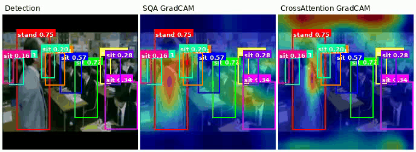
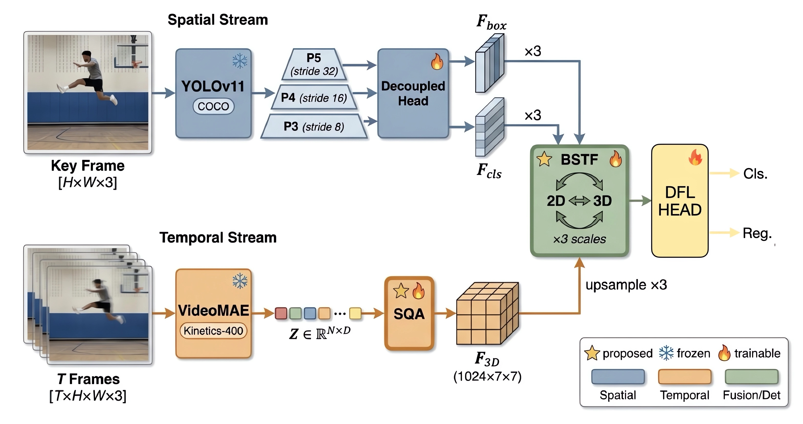
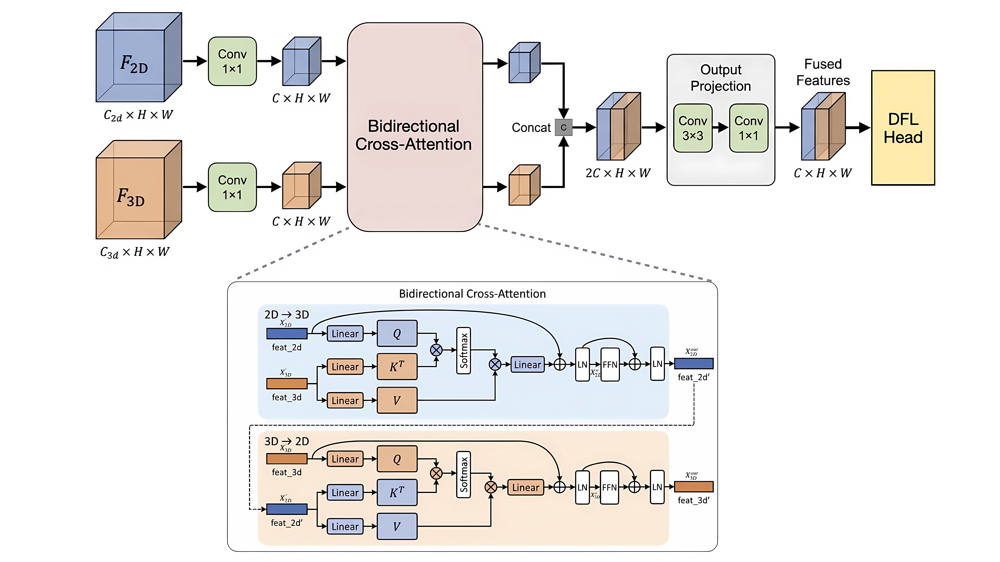
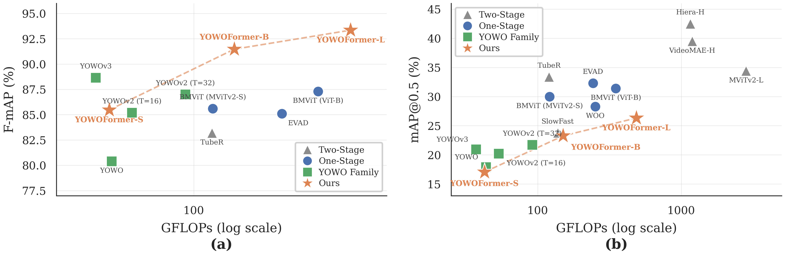
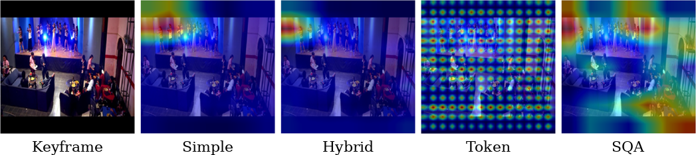
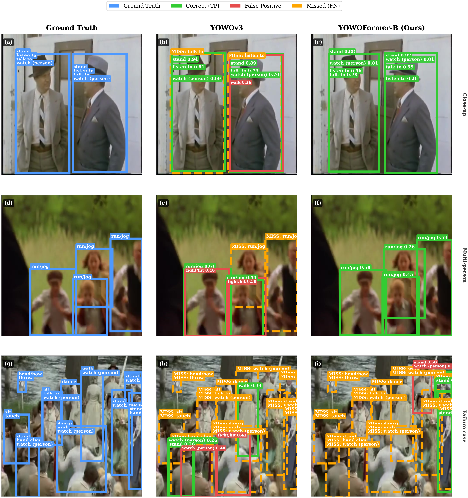

# YOWOFormer

**YOWOFormer: A One-Stage Dual-Stream Transformer for Spatio-Temporal Action Detection**

A unified framework combining YOLOv11 (2D spatial) and VideoMAE (3D temporal) streams with novel adapter and fusion modules for real-time spatio-temporal action detection.

<p align="center">
  
  
</p>

---

## Architecture

<p align="center">
  
</p>

YOWOFormer processes video clips through two parallel streams:

- **2D Stream (YOLOv11)**: Extracts multi-scale spatial features from the key frame
- **3D Stream (VideoMAE + SQA)**: Captures temporal dynamics from the full clip via a pretrained Vision Transformer with a Spatial Query Adapter
- **Fusion**: Merges spatial and temporal features through a learnable fusion module
- **DFL Head**: Produces action bounding boxes and class predictions using Distribution Focal Loss

### SQA (Spatial Query Adapter)

<p align="center">
  
</p>

The SQA bridges the gap between VideoMAE's temporal token space and the spatial feature maps needed for detection. It uses learnable spatial queries with cross-attention to selectively extract spatial information from VideoMAE tokens.

### BSTF (Bidirectional Spatio-Temporal Fusion)

<p align="center">
  
</p>

BSTF performs bidirectional cross-attention between the 2D and 3D feature streams, allowing each stream to attend to complementary information from the other.

---

## Results

### Main Results

| Dataset | mAP@0.5 | Backbone 2D | Backbone 3D | Adapter | Fusion |
|---------|---------|-------------|-------------|---------|--------|
| UCF101-24 | **93.35%** | YOLOv11-n | VideoMAE-Large | SQA | Simple |
| AVA v2.2 | **22.63%** | YOLOv11-n | VideoMAE-Base | SQA | BSTF |

### Comparison with Other Methods

#### UCF101-24

| Method | Backbone | mAP@0.5 | Params (M) | GFLOPs | FPS |
|--------|----------|---------|-----------|--------|-----|
| YOWO (2021) | DarkNet-19 + 3D-ResNext | 80.4% | 121.4 | 43.7 | 34 |
| YOWO-Plus (2022) | DarkNet-19 + 3D-ResNext | 84.9% | 121.4 | 43.7 | 33 |
| YOWOv2-L T=16 (2023) | DarkNet-19 + 3D-ResNext | 85.2% | 109.7 | 53.6 | 30 |
| YOWOv2-L T=32 (2023) | DarkNet-19 + 3D-ResNext | 87.0% | 109.7 | 91.9 | 22 |
| YOWOv3 T=16 (2025) | YOLOv8 + 3D-ResNext | 88.64% | 54.7 | 37.2 | - |
| **YOWOFormer-S** | YOLOv11-n + VideoMAE-S | 85.47% | 60.0 | 42.6 | 42.6 |
| **YOWOFormer-B** | YOLOv11-n + VideoMAE-B | 91.47% | 145.0 | 150.4 | 26.8 |
| **YOWOFormer-L** | YOLOv11-n + VideoMAE-L | **93.35%** | 350.0 | 486.1 | 9.9 |

#### AVA v2.2

| Method | Backbone | mAP@0.5 | Params (M) | GFLOPs | FPS |
|--------|----------|---------|-----------|--------|-----|
| YOWO T=16 (2021) | DarkNet-19 + 3D-ResNext | 17.9% | 121.4 | 43.7 | 34 |
| YOWOv2-L T=16 (2023) | DarkNet-19 + 3D-ResNext | 20.2% | 109.7 | 53.6 | 30 |
| YOWOv2-L T=32 (2023) | DarkNet-19 + 3D-ResNext | 21.7% | 109.7 | 91.9 | 22 |
| YOWOv3 T=16 (2025) | YOLOv8 + 3D-ResNext | 20.93% | 54.7 | 37.2 | - |
| **YOWOFormer-B** | YOLOv11-n + VideoMAE-B | **22.63%** | 145.0 | 150.4 | 26.8 |

### Ablation Studies

#### Adapter Comparison (YOLOv11-n + VideoMAE-Base + Simple Fusion)

| Adapter | UCF mAP@0.5 | Adapter Params (M) | GFLOPs |
|---------|-------------|---------------------|--------|
| Simple | 88.58% | 10.23 | 141.8 |
| Token | 90.79% | 17.98 | 150.0 |
| Hybrid | 88.89% | 49.89 | 147.3 |
| **SQA (Ours)** | **91.43%** | 25.49 | 143.4 |

#### Fusion Comparison (YOLOv11-n + VideoMAE-Base + SQA)

| Fusion | UCF mAP@0.5 | AVA mAP@0.5 |
|--------|-------------|-------------|
| **Simple** | **91.43%** | 22.42% |
| CFAM | 91.61% | 22.33% |
| **BSTF (Ours)** | 91.47% | **23.27%** |

#### VideoMAE Scale (YOLOv11-n + SQA + Simple Fusion)

| VideoMAE | UCF mAP@0.5 | AVA mAP@0.5 | Params (M) | GFLOPs | FPS |
|----------|-------------|-------------|-----------|--------|-----|
| Small | 85.47% | 17.05% | 60.0 | 42.6 | 42.6 |
| Base | 91.47% | 23.27% | 145.0 | 150.4 | 26.8 |
| **Large** | **93.35%** | **26.32%** | 350.0 | 486.1 | 9.9 |

#### Temporal Length (YOLOv11-n + VideoMAE-Base + SQA + Simple)

| Frames | UCF mAP@0.5 | AVA mAP@0.5 | GFLOPs | FPS |
|--------|-------------|-------------|--------|-----|
| 8 | 89.16% | 13.1% | 70.5 | 60.4 |
| **16** | **91.43%** | **22.42%** | 143.4 | 29.2 |

<p align="center">
  
</p>

### Qualitative Results

#### Adapter Attention (GradCAM)

<p align="center">
  
</p>

#### Fusion Attention (GradCAM)

<p align="center">
  
</p>

#### Detection Comparison

<p align="center">
  
</p>

---

## Model Zoo

| Config | 3D Backbone | Adapter | Fusion | UCF mAP | AVA mAP | Params | GFLOPs | FPS |
|--------|-------------|---------|--------|---------|---------|--------|--------|-----|
| YOWOFormer-S | VideoMAE-Small | SQA | Simple | 85.47% | 17.05% | 60M | 42.6 | 42.6 |
| YOWOFormer-B | VideoMAE-Base | SQA | Simple | 91.43% | 22.42% | 145M | 150.4 | 26.8 |
| YOWOFormer-B+BSTF | VideoMAE-Base | SQA | BSTF | 91.47% | **22.63%** | 145M | 150.4 | 26.8 |
| YOWOFormer-L | VideoMAE-Large | SQA | Simple | **93.35%** | 26.32% | 350M | 486.1 | 9.9 |

Pretrained weights: *Coming soon*

---

## Installation

### Requirements

- Python >= 3.11
- PyTorch >= 2.0
- CUDA >= 11.8
- GPU with >= 10 GB VRAM (for training with VideoMAE-Base)

### Setup

```bash
git clone https://github.com/vasuthakaew/YOWOFormer.git
cd YOWOFormer
pip install -e .
```

---

## Dataset Preparation

### UCF101-24

1. Download UCF101-24 from the [official source](https://www.crcv.ucf.edu/data/UCF101.php) or the corrected annotations from [GitHub](https://github.com/gurkirt/corrected-UCF101-Annots)

2. Organize the directory structure:

```
data/UCF101-24/
├── rgb-images/
│   ├── Basketball/
│   │   ├── v_Basketball_g01_c01/
│   │   │   ├── 00001.jpg
│   │   │   ├── 00002.jpg
│   │   │   └── ...
│   │   └── ...
│   └── ...
├── labels/
│   ├── Basketball/
│   │   ├── v_Basketball_g01_c01/
│   │   │   ├── 00001.txt
│   │   │   └── ...
│   │   └── ...
│   └── ...
├── splitfiles/
│   ├── trainlist01.txt
│   └── testlist01.txt
└── testframes.txt
```

### AVA v2.2

1. Download AVA v2.2 from [Google Research](https://research.google.com/ava/download.html)

2. Organize the directory structure:

```
data/AVA/
├── frames/
│   ├── <video_id>/
│   │   ├── <video_id>_000001.jpg
│   │   └── ...
│   └── ...
├── annotations/
│   ├── ava_train_v2.2.csv
│   ├── ava_val_v2.2.csv
│   ├── ava_action_list_v2.2_for_activitynet_2019.pbtxt
│   ├── ava_val_excluded_timestamps_v2.2.csv
│   └── ava_included_timestamps_v2.2.txt
└── frame_lists/
    ├── train.csv
    └── val.csv
```

---

## Quick Start

### Training

```bash
# Train on UCF101-24 (recommended config)
python train.py -c config/yolov11_videomae.yaml

# Train on AVA v2.2
python train.py -c config/yolov11_videomae.yaml --dataset ava --data_root data/AVA

# Train with traditional 3D backbone (I3D)
python train.py -c config/yolov11.yaml
```

### Evaluation

```bash
# Evaluate a checkpoint
python evaluate.py -c weights/best.pth --dataset ucf --data_root data/UCF101-24
```

### Visualization

```bash
# Visualize detections on video
python visualize.py -c weights/best.pth --input video.mp4 --output output/
```

---

## Configuration

Configuration files are in `config/`:

| Config | Description |
|--------|-------------|
| `default.yaml` | Base training config with all options documented |
| `yolov11_videomae.yaml` | YOLOv11 + VideoMAE (recommended) |
| `yolov11.yaml` | YOLOv11 + traditional 3D backbone (I3D/ResNet) |

Key training settings:

```yaml
# Optimizer
optimizer_type: adamw
learning_rate: 0.0001
weight_decay: 0.0005

# Scheduler
use_warmup: true
max_step_warmup: 500

# VideoMAE freezing strategy
freeze_bb3D: true        # Freeze VideoMAE initially
unfreeze_epoch: 5         # Unfreeze at epoch 5 with 0.1x LR

# Loss (Task-Aligned Learning)
loss: tal
scale_cls_loss: 0.5
scale_box_loss: 7.5
scale_dfl_loss: 1.5

# EMA
use_ema: true
ema_decay: 0.9999
```

---

## Project Structure

```
YOWOFormer/
├── train.py                           # Training script
├── evaluate.py                        # Evaluation script
├── visualize.py                       # Visualization script
├── config/                            # Configuration files
│
└── yowoformer/
    ├── model/
    │   ├── yowoformer.py              # Main model architecture
    │   ├── backbone2d/                # YOLOv11, YOLOv8
    │   ├── backbone3d/                # VideoMAE (+ SQA/Token/Hybrid adapters),
    │   │                              # I3D, ResNet, ResNeXt, MobileNet, ShuffleNet
    │   ├── fusion/                    # Simple, BSTF, CFAM, CBAM, SE,
    │   │                              # Channel, Spatial, LKA, MultiHead
    │   └── head/                      # DFL detection head
    ├── datasets/                      # UCF101-24, AVA v2.2
    ├── utils/                         # Loss, EMA, LR scheduler, etc.
    └── evaluator/                     # mAP computation, AVA official eval
```

---

## Supported Components

### 2D Backbones
- YOLOv11 (n / s / m / l / x)
- YOLOv8 (n / s / m / l / x)

### 3D Backbones
- VideoMAE (Small / Base / Large) with adapters:
  - **SQA** (Spatial Query Adapter) — cross-attention based, best accuracy
  - **Token** — full spatial token reconstruction
  - **Hybrid** — token + 3D convolution
  - **Simple** — CLS token projection baseline
- I3D, ResNet-18/50/101, ResNeXt-101
- MobileNet / MobileNetV2, ShuffleNet / ShuffleNetV2

### Fusion Modules
- **Simple** — concatenation + ReLU (best for UCF)
- **BSTF** — bidirectional cross-attention (best for AVA)
- CFAM, CBAM, SE, Channel, Spatial, LKA, MultiHead

---

## Citation

```bibtex
@article{thakaew2026yowoformer,
  title={YOWOFormer: A One-Stage Dual-Stream Transformer for Spatio-Temporal Action Detection},
  author={Thakaew, Vasu},
  journal={IEEE Access},
  year={2026}
}
```

## Acknowledgements

This project builds upon [YOWOv3](https://github.com/Hope1337/YOWOv3). We thank the authors for their excellent work on real-time spatio-temporal action detection, which served as the foundation for this research.

## License

MIT License
